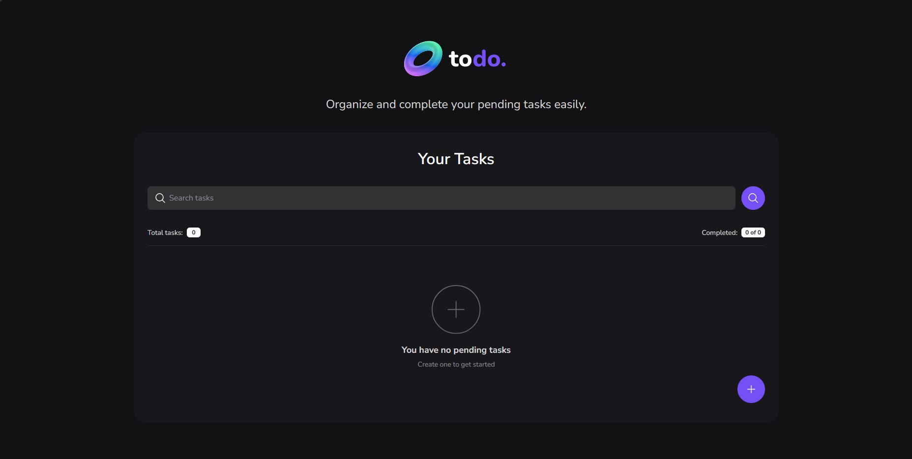

# 📝 Todo List App

An interactive Todo List application built with HTML, CSS, and JavaScript.

---

## 🚀 Live Demo

https://darialozovska.github.io/todo-list-app/

---

## 📌 About the Project

This project is a dynamic Todo List application created as part of my frontend learning journey.

The goal was to practice working with the DOM, managing UI state, and building interactive features from scratch using vanilla JavaScript.

Users can create tasks, mark them as completed, search through tasks, and see real-time updates in task counters.

---

## 🛠 Tech Stack

* HTML5
* CSS3
* JavaScript
* Git & GitHub

---

## ✨ Features

* Add tasks via modal window
* Mark tasks as completed
* Toggle task state (completed / active)
* Live search functionality
* Dynamic task counters
* Empty state when no tasks exist
* Interactive UI with SVG icons

---

## 📚 What I Learned

* DOM manipulation and dynamic element creation
* Working with events (`click`, `input`)
* Managing application state in UI
* Filtering data (search functionality)
* Updating counters dynamically
* Debugging real issues (CSS specificity conflicts)

---

## 🔧 Future Improvements

* Save tasks in `localStorage`
* Add delete task functionality
* Add keyboard support (Enter to add task)
* Improve accessibility
* Add animations for better UX

---

## 👩‍💻 Author

GitHub: https://github.com/darialozovska

📷 Screenshot 

